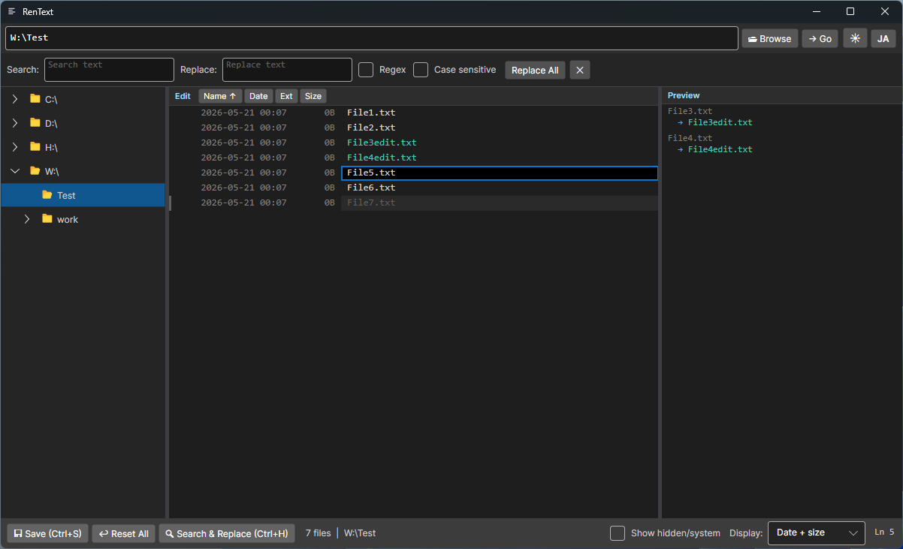

# RenText

**A file renaming tool with a text-editor feel.**

Instead of filling out forms or configuring rules, just edit filenames directly — one line per file, just like a text editor.

[日本語版はこちら](README.ja.md) | [Changelog](CHANGELOG.md)

---

> ⚠️ **Disclaimer — Early Development**
>
> This software is in early development and provided **"AS IS", without warranty of any kind**, express or implied.
> File rename operations are destructive — there is a possibility of unexpected behavior including, but not limited to, **data loss or file corruption**.
> **Back up important files before use**, and use this software entirely at your own risk.
> See the [LICENSE](LICENSE) file (GPL v3) for the full no-warranty clause.

---

## Screenshot



---

## Features

- **Text editor style editing** — each file appears as a line you can edit directly
- **Live preview pane** — see renames before applying (`original → new`)
- **VS Code-style search & replace** (`Ctrl+H`) with regex and case-sensitive options
- **Live regex preview** — preview pane updates in real time as you type the pattern
- **Save with full rollback** (`Ctrl+S`) — if any rename fails, all changes are undone
- **Sort** by name / date / extension (ascending & descending)
- **Display modes** — filename only / with date / with size / with date+size
- **Folder tree** with lazy loading and drive type icons
- **Dark / Light mode** toggle
- **Keyboard navigation** — `↑` `↓` `PageUp` `PageDown` in the file list

---

## Requirements

- Windows 10 / 11 (x64)
- [.NET 9 Desktop Runtime](https://dotnet.microsoft.com/download/dotnet/9.0) (x64)

---

## Download & Run

1. Download the latest release from the [Releases](../../releases) page
2. Extract the zip file
3. Run `RenText.exe`

The following files must be kept in the same folder:

```
RenText.exe
av_libglesv2.dll
libHarfBuzzSharp.dll
libSkiaSharp.dll
```

---

## Usage

### Basic workflow

1. Select a folder from the folder tree (left pane) or type a path in the address bar
2. Edit filenames directly in the center pane
3. Check the preview pane (right) for a summary of changes
4. Press `Ctrl+S` to apply all renames at once

### Keyboard shortcuts

| Key | Action |
|-----|--------|
| `Ctrl+S` | Save (apply renames) |
| `Ctrl+H` | Toggle search & replace panel |
| `↑` / `↓` | Move between files (preserves cursor column) |
| `PageUp` / `PageDown` | Move by one page |

### Search & Replace

- Open with `Ctrl+H`
- Supports **regular expressions** and **case-sensitive** matching
- The preview pane shows the result in real time before you apply

#### Regex examples

Use `()` to capture a part of the filename, then reference it with `$1`, `$2`, … in the replacement.

| Search | Replace | Before | After |
|--------|---------|--------|-------|
| `^\d+[-_\s](.+)` | `$1` | `001_photo.jpg` | `photo.jpg` |
| `(.+)_(.+)\.jpg` | `$2_$1.jpg` | `family_2024.jpg` | `2024_family.jpg` |
| `(\d{4})-(\d{2})-(\d{2})` | `$1$2$3` | `photo_2024-05-21.jpg` | `photo_20240521.jpg` |
| `\s*[\(\[].*?[\)\]]` | *(empty)* | `Movie Title (2024).mp4` | `Movie Title.mp4` |
| `\.JPG$` | `.jpg` | `IMG_001.JPG` | `IMG_001.jpg` |

> **Tips**
> - Leave the **Replace** field empty to simply delete the matched text.
> - `$1`, `$2`, … correspond to each `()` group from left to right.
> - Enable the **Regex** checkbox — otherwise `$1` is treated as a literal string.

---

## Build from Source

**Requirements:** .NET 9 SDK

```bash
git clone https://github.com/umineko73/RenText.git
cd RenText
dotnet run
```

**Publish as a single folder:**

```bash
dotnet publish -c Release -r win-x64 --self-contained false -p:PublishSingleFile=true --output ./publish
```

---

## Tech Stack

| | |
|-|-|
| Language | C# / .NET 9 |
| UI Framework | [Avalonia UI](https://avaloniaui.net/) 12 |
| MVVM | [CommunityToolkit.Mvvm](https://learn.microsoft.com/en-us/dotnet/communitytoolkit/mvvm/) |

---

## License

[GPL v3](LICENSE) — Copyright (C) 2026 umineko73

This program is free software: you can redistribute it and/or modify it under the terms of the GNU General Public License as published by the Free Software Foundation, either version 3 of the License, or (at your option) any later version.
